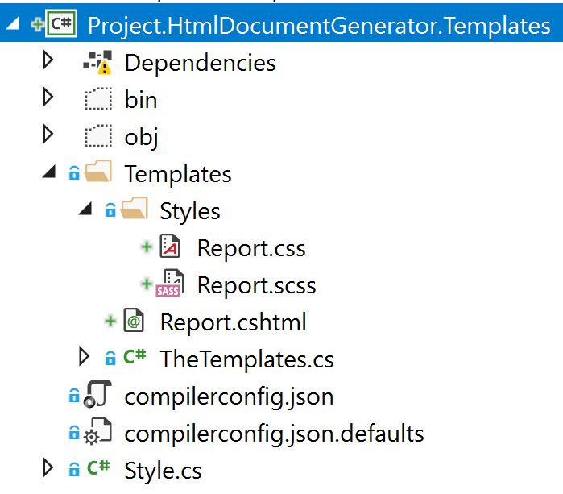

Title: Using Sass with RazorLight
Published: 9/4/2018
Tags: ["RazorLight", "Sass", "Web Compiler", "Razor"]

---

# Using Sass with RazorLight

I've been using [RazorLight](https://github.com/toddams/RazorLight) to generate HTML for PDF reports. It works pretty well supporting .NET Standard 2.0.

One of the problems I had was styling these reports. I did not want to just use CSS, I wanted to use [Sass](https://sass-lang.com/).

### Transpiling Sass to CSS

I don't have that many reports and they do not change very often. I decided to use Visual Studio extension [Web Compiler](https://marketplace.visualstudio.com/items?itemName=MadsKristensen.WebCompiler).

- I did not want to add this to the build pipeline
- I don't mind checking in the CSS files
- I don't mind embedding the CSS files
- I can always change it later. Be pragmatic.

I setup the web compiler to compile on save. I also made the CSS output files an embedded resource.

### Project Structure

This is how I structured my project.

I have a _Templates_ folder which contains all the templates (\*.cshtml files) and stylesheets under _Styles_ folder (\*.css and \*.scss files).

_TheTemplates.cs_ is a helper class to make it easy to get a reference to assembly.

### Getting the CSS

By using reflection we can read the embedded CSS file as a string.

This returns the CSS wrapped &lt;style&gt; tag for use in the RazorLight template.

### Embedding the stylesheet

Finally we can add the stylesheet to our template Report.cshtml using Raw method.

